# EPBA — Implementation Document

## 1. Overview

**EPBA (Electronic Patient Bedside Assistant)** is a multi-agent healthcare AI system that enables doctors to query patient records using **natural language** — via **text or voice**. The system combines **structured data** (FHIR-derived SQLite database) with **unstructured data** (embedded patient reports in ChromaDB) to produce comprehensive clinical answers.

Both data sources are queried in **parallel**, and an LLM synthesizes the combined results into a single, comprehensive clinical answer.

### Input Modalities

| Modality | Path | Technology |
|----------|------|------------|
| **Text** | User types → Frontend → Orchestrator → Agents → Response | Streamlit `st.chat_input` → REST/A2A |
| **Audio** | User speaks → Frontend → OpenAI Realtime API (STT) → Orchestrator → Realtime API (TTS) → Audio response | `st.audio_input` → WebSocket → Whisper STT → GPT TTS |

---

## 2. High-Level Architecture

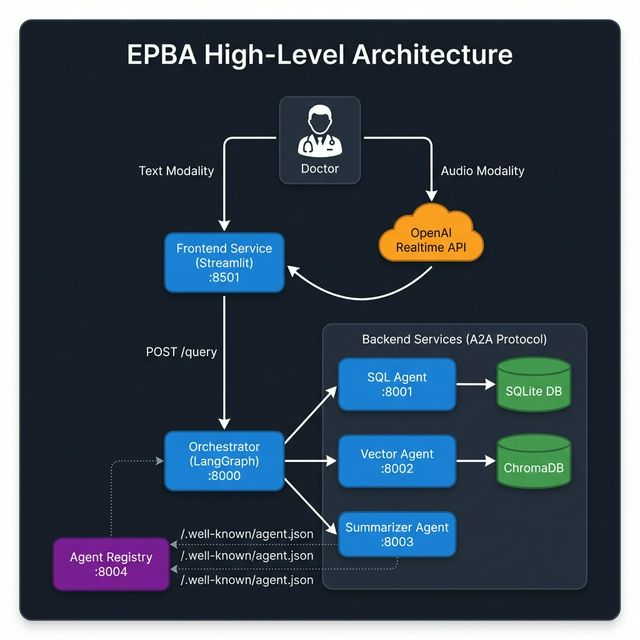

The system follows a **microservices architecture** with **six independently deployable services** communicating over the **Google A2A (Agent-to-Agent) protocol**. The Orchestrator sits at the center, coordinating parallel calls to the SQL and Vector agents, then passing their results to the Summarization Agent.

**Key architectural features:**
- **Dual input modalities**: Text queries go directly to the Orchestrator; audio queries are transcribed via OpenAI's Realtime API before being forwarded.
- **A2A Protocol**: All inter-agent communication uses Google's Agent-to-Agent protocol (`POST /message:send`), with each agent self-describing via Agent Cards (`GET /.well-known/agent.json`).
- **Agent Registry**: A centralized discovery service polls all agents and exposes their status and capabilities.

---

## 3. Technology Stack

| Layer | Technology |
|-------|-----------|
| **Frontend** | Streamlit 1.x |
| **Backend Framework** | FastAPI + Uvicorn |
| **Orchestration** | LangGraph (`StateGraph`) |
| **LLM** | OpenAI GPT-4o-mini (`temperature: 0.0`) |
| **Embeddings** | OpenAI `text-embedding-3-small` |
| **Structured DB** | SQLite (FHIR STU3 derived) |
| **Vector DB** | ChromaDB (persistent) |
| **SQL Agent** | Single-Shot Query Generator (Optimized) | — |
| **Vector Agent** | LangChain `RetrievalQA` (stuff chain) | — |
| **Summarization Agent** | Balanced Clinical Synthesis (Modular `prompts.yaml`) | — |
| **Voice/Audio** | OpenAI Realtime API (WebSocket), Whisper-1 STT | — |
| **Audio Processing** | `scipy`, `numpy` (PCM16 conversion, resampling, normalization) | — |
| **Observability** | **Langfuse Distributed Tracing** (EU Region) | — |
| **Inter-Agent Protocol** | Google A2A Protocol RC v1.0 | — |
| **Agent Discovery** | Agent Cards (`/.well-known/agent.json`) | — |
| **Configuration** | YAML (`config/settings.yaml`) + `.env` overrides |
| **Containerization** | Docker + Docker Compose |

---

## 4. Project Structure

```
EPBA/
├── services/
│   ├── orchestrator/              # Central coordinator (LangGraph + A2A)
│   │   ├── src/app.py             # FastAPI app + A2A agent card
│   │   └── src/graph.py           # LangGraph StateGraph definition
│   ├── sql_agent/                 # Structured data agent
│   │   ├── src/app.py             # FastAPI app + A2A registration
│   │   └── src/agent.py           # SQLAgentService (LangChain)
│   ├── vector_agent/              # Unstructured data agent
│   │   ├── src/app.py             # FastAPI app + A2A registration
│   │   ├── src/agent.py           # VectorAgentService (LangChain)
│   │   └── src/ingest.py          # Document ingestion pipeline
│   ├── summarization_agent/       # LLM synthesis agent
│   │   ├── src/app.py             # FastAPI app + A2A registration
│   │   └── src/agent.py           # SummarizationService
│   ├── frontend/                  # Streamlit UI (Chat + Agent Directory)
│   │   └── src/
│   │       ├── app.py             # Main Streamlit application
│   │       └── realtime_client.py # OpenAI Realtime API client (S2S)
│   └── agent_registry/            # Centralized agent discovery
│       └── src/app.py             # FastAPI app (polls agent cards)
├── shared/                        # Cross-service shared library
│   ├── src/
│   │   ├── config.py              # Settings singleton (YAML + env)
│   │   ├── logger.py              # Structured logging (structlog)
│   │   ├── models.py              # Pydantic request/response models
│   │   ├── a2a_models.py          # A2A Protocol data models
│   │   ├── a2a_server.py          # Reusable A2A FastAPI router factory
│   │   └── prompts/
│   │       └── voice_summary.py   # System prompt for voice synthesis
│   └── setup.py                   # Editable install (pip install -e)
├── config/
│   └── settings.yaml              # Central configuration
├── data/
│   ├── fhir_stu3/                 # Raw FHIR JSON bundles (~557 files)
│   ├── patient_reports/           # Medical reports (PDF/TXT)
│   ├── patients.db                # SQLite database
│   └── chroma_db/                 # ChromaDB persistent store
├── docs/
│   ├── Implementation.md          # This document
│   └── diagrams/                  # Architecture diagrams (PNG + MMD)
├── docker-compose.yml             # Multi-container orchestration
├── Makefile                       # Build/run/clean automation
├── start_all_locally.py           # Local development launcher
├── requirements.txt               # Python dependencies
└── .env                           # Environment variables (API keys)
```

---

## 5. Service Deep-Dive

### 5.1 Orchestrator Service

**Port**: `8000` &nbsp;|&nbsp; **Endpoint**: `POST /query` &nbsp;|&nbsp; **A2A**: `POST /message:send`

The Orchestrator is the brain of the system. It uses **LangGraph's `StateGraph`** to define a directed acyclic graph (DAG) of agent calls, with all inter-agent communication using the **A2A protocol**.

#### Workflow Graph

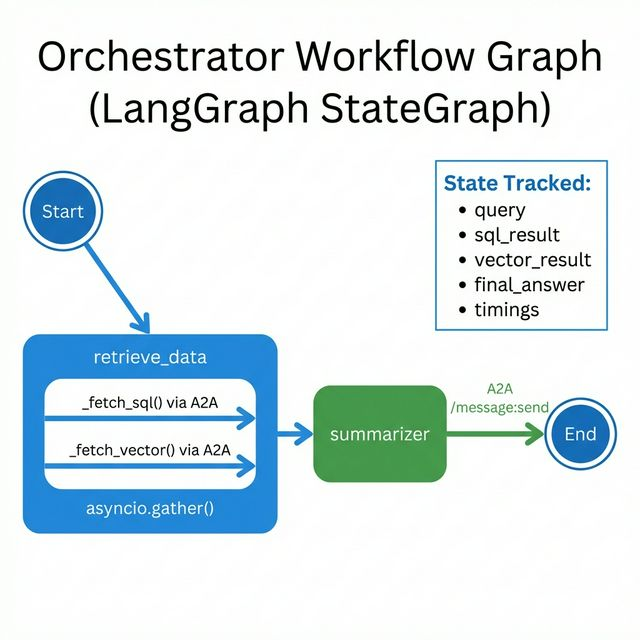

**How it works**:

1. **`retrieve_data` node** — Fires `_fetch_sql()` and `_fetch_vector()` concurrently using `asyncio.gather()`. Both make A2A `POST /message:send` requests to their respective agents.
2. **`summarizer` node** — Sends the query + SQL result + Vector result to the Summarization Agent via A2A `process_full_message` (structured data parts).
3. **State** — A `TypedDict` called `AgentState` tracks `query`, `sql_result`, `vector_result`, `final_answer`, and per-agent `timings`.

#### A2A Message Handling

| Function | Purpose |
|----------|---------|
| `_build_a2a_request(query)` | Creates a `SendMessageRequest` with a text `Part` |
| `_build_summarizer_a2a_request(query, sql, vec)` | Creates a `SendMessageRequest` with a structured `data` `Part` |
| `_extract_a2a_result(response_json)` | Extracts text from `Task.artifacts[0].parts[0].text` |

---

### 5.2 SQL Agent Service

**Port**: `8001` &nbsp;|&nbsp; **Endpoint**: `POST /query` &nbsp;|&nbsp; **A2A**: `POST /message:send`

Handles **structured data retrieval** from the SQLite database using LangChain's `create_sql_agent`.

#### Key Design Decisions

| Feature | Detail |
|---------|--------|
| **Agent Type** | **Single-Shot Query Generator** (Optimized for <3s latency) |
| **SQL Generation** | Direct prompt-to-SQL without iterative ReAct loop |
| **Schema Pre-loading** | Full DB schema injected into system prompt to avoid `sql_db_schema` tool calls |
| **Fail-Fast Logic** | If no patient found in Step 1, agent stops immediately — no wasted queries |
| **Error Handling** | Graceful fallback: `"I could not retrieve the data in time."` on timeout |

#### SQL Agent Flow

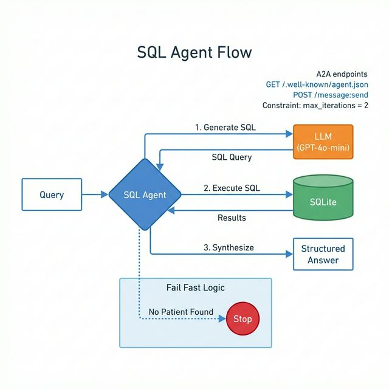

#### Database Schema

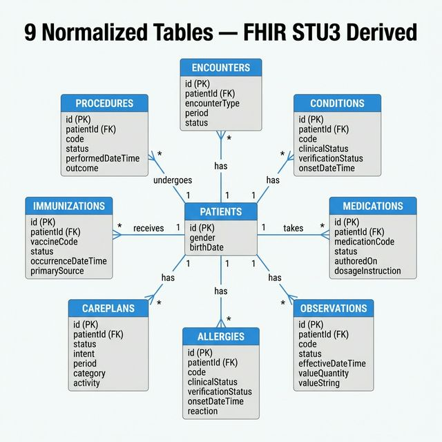

The database contains **9 normalized tables** — all linked to the central `patients` table via `patient_id` foreign keys:

| Table | Records From |
|-------|-------------|
| `patients` | Patient demographics, identifiers, address |
| `encounters` | Clinical visits (class, codes, provider) |
| `conditions` | Diagnoses (onset, abatement, SNOMED codes) |
| `medications` | Prescriptions (status, reason) |
| `observations` | Lab results, vitals (value, units) |
| `allergies` | Allergy intolerances (criticality) |
| `careplans` | Treatment plans |
| `immunizations` | Vaccination records |
| `procedures` | Surgical/clinical procedures |

---

### 5.3 Vector Agent Service

**Port**: `8002` &nbsp;|&nbsp; **Endpoint**: `POST /query` &nbsp;|&nbsp; **A2A**: `POST /message:send`

Handles **unstructured data retrieval** using semantic similarity search over embedded patient medical reports.

#### Components

| Component | Technology | Config |
|-----------|-----------|--------|
| **Embedding Model** | `text-embedding-3-small` (OpenAI) | — |
| **Vector Store** | ChromaDB (persistent) | `data/chroma_db/` |
| **Retrieval Strategy** | Top-K similarity search | `k = 3` |
| **QA Chain** | `RetrievalQA` with `stuff` chain type | — |
| **Text Splitter** | `RecursiveCharacterTextSplitter` | `chunk_size=600`, `overlap=50` |

#### Vector Agent Flow

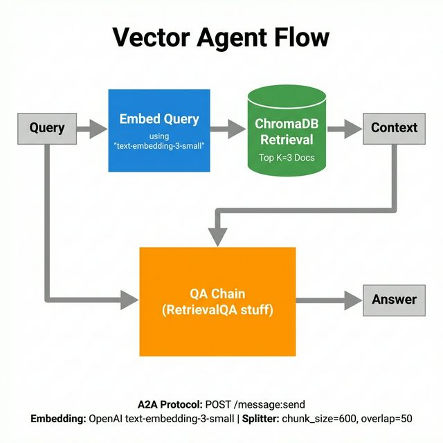

---

### 5.4 Summarization — Dual Modality

The synthesis step differs depending on the input modality:

| Modality | Synthesizer | Model | Output |
|----------|------------|-------|--------|
| **Text** | Summarization Agent (A2A, port `8003`) | GPT-4o-mini | Markdown text with citations |
| **Audio** | OpenAI Realtime API (WebSocket) | GPT-Realtime | Spoken audio (PCM16) |

#### Summarization Data Flow

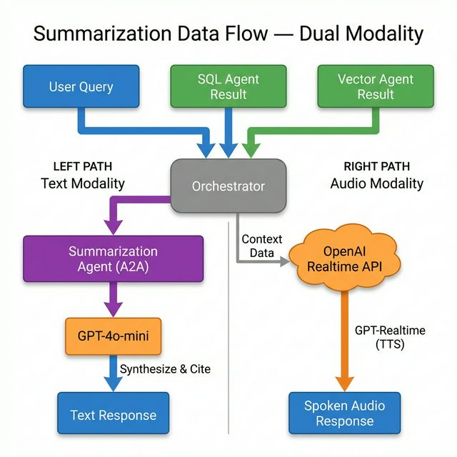

##### Text Path (Summarization Agent)

**Port**: `8003` &nbsp;|&nbsp; **A2A**: `POST /message:send`

The Orchestrator sends the query + SQL result + Vector result to the Summarization Agent via A2A `process_full_message`. The agent uses **GPT-4o-mini** and a modular prompt system (`prompts.yaml`) to:
- Synthesize data from both structured and unstructured sources
- Flag **conflicting information** (e.g., name discrepancies between sources)
- Provide a **balanced clinical summary** (neither too concise nor too elaborative)
- Fall back to whichever source has data if one is empty
- Provide **citations** (e.g., "According to the database...")

##### Audio Path (GPT-Realtime)

For voice queries, the Summarization Agent is **not called**. Instead, the Orchestrator's text response is sent back to the Frontend, which feeds it as **context data** into the OpenAI Realtime API's `response.create` event. **GPT-Realtime** then generates a concise spoken summary using the `VOICE_SUMMARY_SYSTEM_PROMPT` (3-4 sentences, calm medical tone, no markdown).

---

### 5.5 Agent Registry Service

**Port**: `8004` &nbsp;|&nbsp; **Protocol**: Google A2A

A centralized **agent discovery service** that polls each agent's `/.well-known/agent.json` endpoint and exposes their status via REST.

#### How it works

1. **Startup**: Waits 2s for other services, then fetches all Agent Cards.
2. **Background Refresh**: Polls every 30 seconds via `asyncio.create_task(_periodic_refresh)`.
3. **Storage**: In-memory `dict[str, RegisteredAgent]` keyed by agent name.

#### API Endpoints

| Endpoint | Method | Description |
|----------|--------|-------------|
| `/agents` | GET | List all registered agents with status, latency, and full Agent Card |
| `/agents/{name}` | GET | Get a specific agent's card (case-insensitive match) |
| `/agents/refresh` | POST | Manually trigger a refresh of all Agent Cards |
| `/health` | GET | Service health + registered/online agent counts |

#### Agents Tracked

| Agent | Base URL |
|-------|----------|
| SQL Agent | `http://sql_agent:8001` |
| Vector Agent | `http://vector_agent:8002` |
| Summarization Agent | `http://summarizer_agent:8003` |
| Orchestrator | `http://orchestrator:8000` |

---

### 5.6 Frontend Service

**Port**: `8501` &nbsp;|&nbsp; **Framework**: Streamlit

The frontend provides **two tabs**:

#### Tab 1: 💬 Chat

A chat-based **Healthcare AI Assistant** interface supporting both text and voice input:

| Feature | Description |
|---------|-------------|
| **Text Input** | `st.chat_input` with message history and sidebar agent trace |
| **Voice Input** | `st.audio_input` → `RealtimeClient` → OpenAI Realtime API |
| **Agent Execution Trace** | Sidebar showing real-time status of each agent (✅ success / ⚠️ no data / ❌ error) |
| **Per-Agent Timing** | Displays execution time for SQL Agent, Vector Agent, and Summarizer |
| **Source Data Inspector** | Expandable "View Source Data" section showing raw SQL and Vector results |
| **Error Handling** | Graceful display of connection errors and HTTP failures |

##### Audio / Voice Flow (`RealtimeClient`)

The `realtime_client.py` module implements a **Speech-to-Speech (S2S) pipeline**:

1. **Audio Capture** → Streamlit's `st.audio_input` records WAV audio.
2. **PCM16 Conversion** → `scipy` converts to mono 24kHz PCM16, normalizes volume.
3. **STT** → Audio sent to OpenAI Realtime API (WebSocket) → Whisper-1 transcribes.
4. **Orchestrator Query** → Transcript sent to Orchestrator `POST /query`.
5. **TTS** → Orchestrator response fed as context to Realtime API → GPT generates spoken answer.
6. **Playback** → PCM16 audio converted back to WAV, played via `st.audio`.

**Configuration** (from `settings.yaml` / env):

| Setting | Default | Description |
|---------|---------|-------------|
| `AUDIO_SAMPLE_RATE` | `24000` | Input/output sample rate |
| `AUDIO_INPUT_FORMAT` | `pcm16` | Audio format for Realtime API |
| `AUDIO_VOICE` | `alloy` | TTS voice selection |
| `VAD_TYPE` | `server_vad` | Voice Activity Detection type |
| `VAD_THRESHOLD` | `0.5` | VAD sensitivity |

##### UI Responsiveness & Layout
- **Dynamic Chat Alignment**: The chat input bar uses a dynamic CSS calculation (`calc(300px + 5rem)`) to shift smoothly when the sidebar opens.
- **Optimized Controls**: The microphone button is precisely positioned (`right: 8.5rem`) to sit clearly apart from the "Send" button.

#### Tab 2: 🤖 Agent Directory

A real-time dashboard showing all registered agents from the Agent Registry:

| Feature | Description |
|---------|-------------|
| **Agent Cards** | 2-column grid displaying each agent's name, status (🟢/🔴), description, version |
| **Capabilities** | Streaming support, push notifications, I/O mode badges |
| **Skills & Examples** | Expandable skill details with example queries |
| **Latency Monitoring** | Response time from Agent Registry health checks |
| **Full JSON** | Expandable raw Agent Card JSON for debugging |
| **Refresh** | Manual refresh button + 15s auto-cache TTL |

---

## 6. Shared Library

The `shared/` package is an **editable-installable** Python package (`pip install -e shared/`) providing cross-service utilities:

| Module | Purpose |
|--------|---------|
| `config.py` | **Settings singleton** — loads `config/settings.yaml`, merges with `.env` and env overrides. Smart path resolution for local vs. Docker contexts. |
| `logger.py` | **Structured logging** — `structlog` with JSON output, ISO timestamps, per-service log files under `logs/<service>/`. Includes `log_execution_time` context manager. |
| `models.py` | **Pydantic models** — `AgentRequest`, `AgentResponse`, `SummarizationRequest` for type-safe inter-service contracts. |
| `a2a_models.py` | **A2A Protocol models** — Full implementation of Google A2A RC v1.0: `AgentCard`, `AgentSkill`, `SendMessageRequest`, `A2ATask`, `Part`, `Message`, `Artifact`, helpers (`create_completed_task`, `create_failed_task`). |
| `a2a_server.py` | **A2A Router factory** — `create_a2a_router(agent_card, process_message)` creates a FastAPI `APIRouter` with `GET /.well-known/agent.json` and `POST /message:send`. Supports both simple (`str → str`) and full-message (`Message → str`) callbacks. |
| `prompts/voice_summary.py` | **Voice prompt** — System prompt for the Realtime API TTS: concise, spoken-style medical summaries (3-4 sentences, calm tone, no markdown). |

---

## 7. Data Pipeline & Ingestion

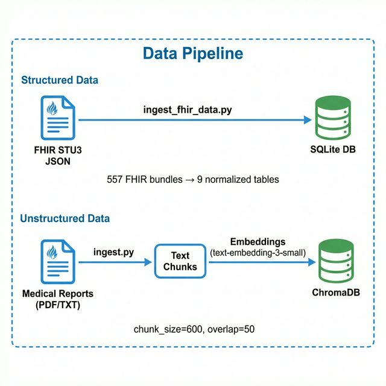

### FHIR STU3 → SQLite (Structured Data)

The `ingest_fhir_data.py` script:
1. Reads each FHIR JSON bundle from `data/fhir_stu3/` (~557 files)
2. Extracts the `Patient` resource first (demographics, identifiers, address)
3. Iterates remaining resources (Encounters, Conditions, Medications, Observations, Allergies, CarePlans, Immunizations, Procedures)
4. Maps FHIR fields to relational columns and inserts into SQLite
5. Creates **9 normalized tables** with proper foreign key relationships

### Patient Reports → ChromaDB (Unstructured Data)

The `vector_agent/src/ingest.py` script:
1. Scans `data/patient_reports/` for `.txt` and **`.pdf`** files (using `PyPDFLoader`)
2. Loads documents using LangChain's `TextLoader` and `PyPDFLoader`
3. Splits into chunks: `RecursiveCharacterTextSplitter(chunk_size=600, overlap=50)`
4. Embeds with `text-embedding-3-small`
5. Persists to ChromaDB at `data/chroma_db/`

---

## 8. Clinical Interaction Examples

EPBA supports dual-modality interactions. Below are examples showcasing both the Text and Audio workflows:

### 8.1 Text Modality: Initial Query (Interaction 1)
In the **Text Modality**, the user types a natural language query directly into the chat interface. This triggers an immediate A2A message to the Orchestrator, which dispatches the search. The sidebar captures this initiation in the "Execution Trace."

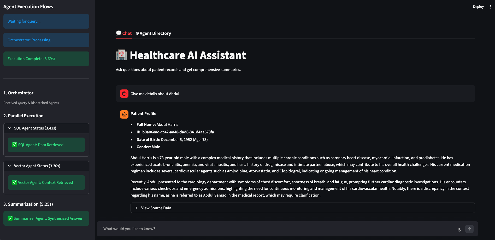

### 8.2 Text Modality: Parallel Agent Execution (Interaction 2)
The UI provides real-time status updates as the SQL and Vector agents process the text-based query. Doctors can monitor the progress of each agent independently, ensuring they have feedback throughout the ~8-10 second lifespan of a typical request.

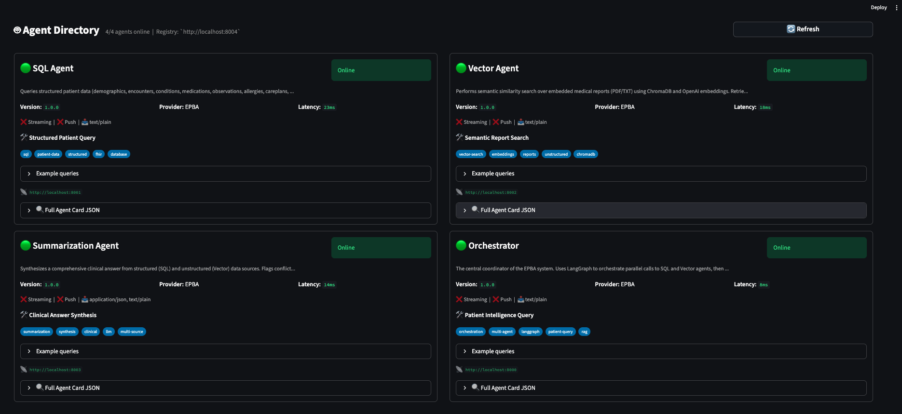

### 8.3 Audio Modality: Voice Analysis (Interaction 3)
In the **Audio Modality**, interaction begins when the user clicks the microphone button. The OpenAI Realtime API handles the VAD (Voice Activity Detection) and transcription before the Orchestrator even receives the text, allowing for a seamless hands-free experience.

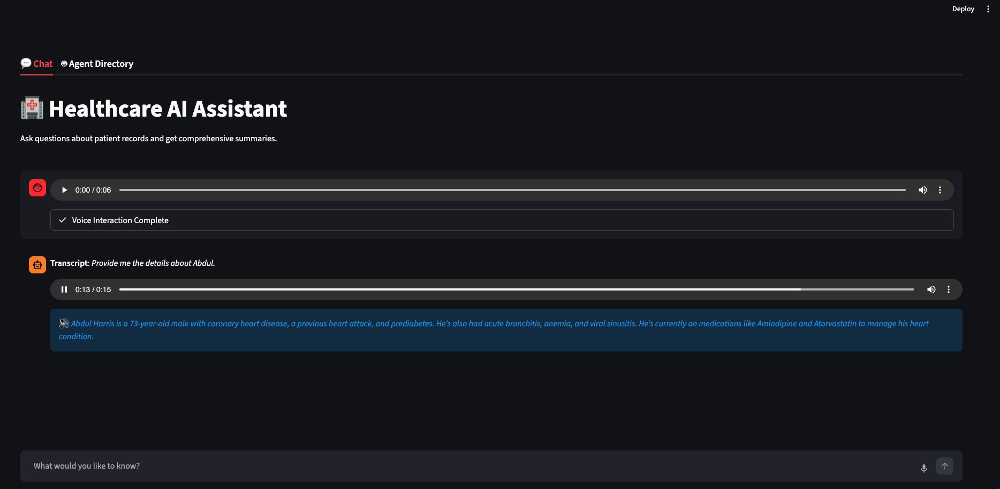

### 8.4 Audio Modality: Speech-to-Speech Results (Interaction 4)
The final result of an audio interaction is delivered via **Speech-to-Speech**. The frontend displays a "Voice Interaction Complete" status alongside an audio playback bar and a real-time transcript of the synthesized clinical answer.

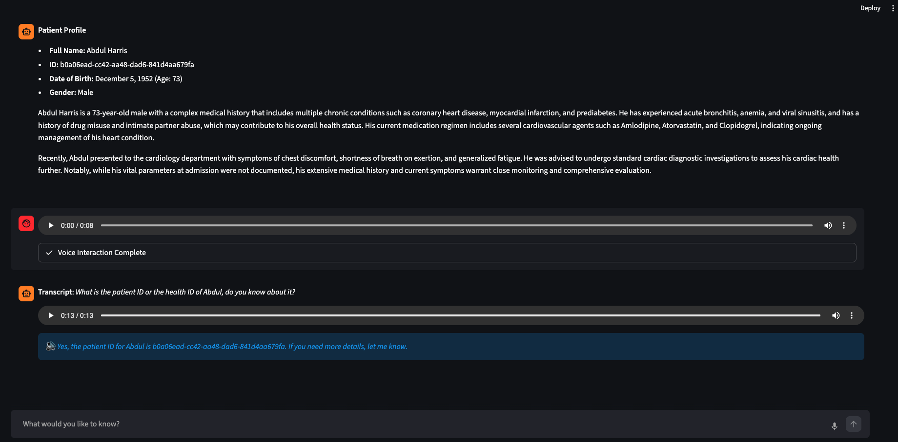

---

## 9. Traceability & Observability (Langfuse)

To ensure clinical safety and performance monitoring, EPBA is fully instrumented with **Langfuse**. This allows for end-to-end distributed tracing across all microservices.

### 9.2 Trace Visualization

The Langfuse dashboard provides two primary views for monitoring the EPBA ecosystem:

#### 9.2.1 High-Level Session Overview
The **Trace List** view provides a chronological record of all user queries. It captures the root "EPBA Orchestration Trace" for every session, allowing administrators to monitor overall system health, total latency, and token costs at a glance.

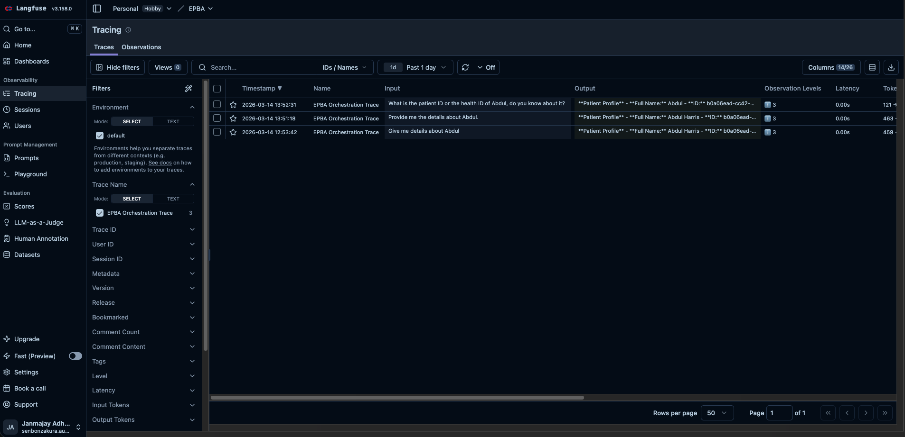

#### 9.2.2 Distributed Trace & Nested Spans
By selecting a specific session, we can drill down into the **Nested Trace Detail**. This view visualizes the distributed execution flow:
- **Orchestrator Root**: The parent span managing the request lifecycle.
- **Agent Spans**: Nested "observations" for the SQL Agent, Vector Agent, and Summarization Agent.
- **LLM Metadata**: Each child span records the exact prompt sent, the model used (`gpt-4o-mini`), and the raw JSON response received from the agent.

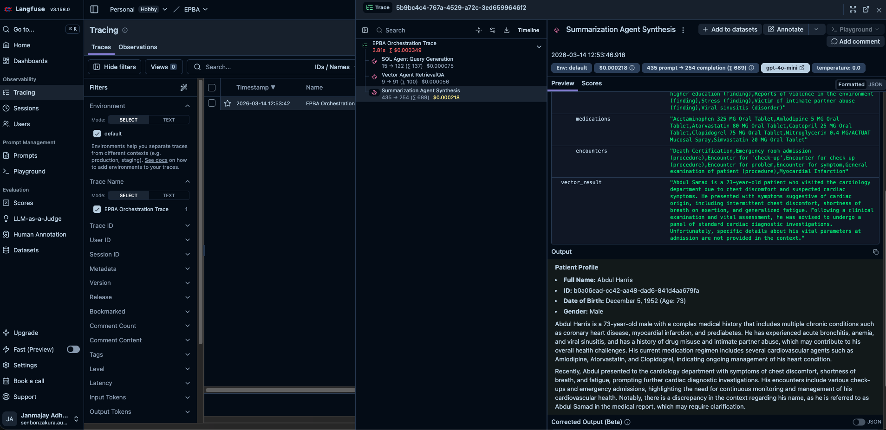

---

## 10. Request Lifecycle Flow

The system coordinates complex interactions between frontends, LLMs, and databases. Below is the multi-modal sequence diagram:

```mermaid
sequenceDiagram
    actor Doctor
    participant UI as Frontend
    participant RT as Realtime API
    participant Orch as Orchestrator
    participant SQL as SQL Agent
    participant Vec as Vector Agent
    participant Sum as Summarizer
    
    rect rgb(40, 60, 90)
    Note over Doctor,UI: Text Modality
    Doctor->>UI: Types question
    UI->>Orch: POST /query
    end
    
    rect rgb(90, 60, 40)
    Note over Doctor,RT: Audio Modality
    Doctor->>UI: Records audio
    UI->>RT: WebSocket (PCM16 audio)
    RT-->>UI: Transcript (Whisper STT)
    UI->>Orch: POST /query (transcript)
    end
    
    par Parallel A2A Execution
        Orch->>SQL: POST /message:send
        Orch->>Vec: POST /message:send
    and
        SQL->>SQL: Generate & Run SQL
        Vec->>Vec: Embed & Retrieve
    end
    
    SQL-->>Orch: A2A Task (Structured Data)
    Vec-->>Orch: A2A Task (Unstructured Context)
    
    Orch->>Sum: POST /message:send (Query + SQL + Vector)
    Sum-->>Orch: A2A Task (Final Synthesized Answer)
    
    alt Text Response
        Orch-->>UI: JSON Response + Timings
        UI->>Doctor: Display Answer + Trace
    else Audio Response
        UI->>RT: response.create (context from Orchestrator)
        RT-->>UI: Audio stream (PCM16)
        UI->>Doctor: Play audio + Show transcript
    end
```

### 10.1 Step-by-Step Walkthrough

| Step | Action | Component |
|------|--------|-----------|
| 1 | Doctor types/speaks a question | Streamlit Frontend |
| 2a | **Text**: Frontend sends `POST /query` | → Orchestrator |
| 2b | **Audio**: Frontend initiates S2S session via Realtime API | → Realtime API → Orchestrator |
| 3 | Orchestrator initializes state with a **Langfuse Trace ID** | LangGraph |
| 4a | **Parallel**: SQL Agent executes single-shot SQL generation | SQL Agent + SQLite |
| 4b | **Parallel**: Vector Agent performs semantic search | Vector Agent + ChromaDB |
| 5 | Results are aggregated in the `AgentState` | LangGraph State merge |
| 6 | Summarizer generates a balanced clinical synthesis | → Summarization Agent |
| 7 | **Response**: Text results are returned; Audio results are fed back to Realtime API | → Streamlit / GPT-Realtime |

---

## 11. A2A Protocol Implementation

All agents implement the **Google Agent-to-Agent Protocol (RC v1.0)** via the shared `a2a_server.py` router factory.

### Agent Card Discovery

Each agent serves its self-describing manifest at `GET /.well-known/agent.json`:

| Agent | Skills | Tags |
|-------|--------|------|
| **Orchestrator** | Patient Intelligence Query | orchestration, multi-agent, langgraph |
| **SQL Agent** | Structured Patient Query | sql, patient-data, fhir, database |
| **Vector Agent** | Unstructured Report Search | vector, embeddings, chromadb, reports |
| **Summarization Agent** | Clinical Data Synthesis | summarization, llm, synthesis |

### Message Flow

```
Client → POST /message:send (SendMessageRequest)
       → Agent processes query
       ← SendMessageResponse { task: A2ATask { status: completed, artifacts: [...] } }
```

### Key Models (from `a2a_models.py`)

| Model | Purpose |
|-------|---------|
| `AgentCard` | Self-describing agent manifest (name, skills, capabilities) |
| `SendMessageRequest` | Incoming message with `Part` payloads (text or data) |
| `A2ATask` | Task lifecycle: submitted → working → completed/failed |
| `Artifact` | Task output container with `Part` list |
| `Part` | Content unit: `.from_text(str)` or `.from_data(dict)` |

---

## 12. Deployment

### Docker Compose (Production)

All 6 services are containerized and orchestrated via `docker-compose.yml`:

| Service | Port | Depends On |
|---------|------|-----------|
| `orchestrator` | 8000 | sql_agent, vector_agent, summarizer_agent |
| `sql_agent` | 8001 | — |
| `vector_agent` | 8002 | — |
| `summarizer_agent` | 8003 | — |
| `agent_registry` | 8004 | orchestrator, sql_agent, vector_agent, summarizer_agent |
| `frontend` | 8501 | orchestrator, agent_registry |

**Makefile targets**:
- `make build` — Build all Docker images
- `make up` — Start all services
- `make down` — Stop all services
- `make clean` — Remove containers, volumes, logs, and caches
- `make ingest` — Run vector document ingestion inside the container

### Local Development

The `start_all_locally.py` script:
1. Cleans up occupied ports (8000–8004, 8501)
2. Sets `PYTHONPATH` and config overrides
3. Overrides Docker service URLs to `localhost`
4. Starts all 6 services sequentially via `uvicorn` / `streamlit`

---

## 13. Configuration

### `config/settings.yaml`

```yaml
llm:
  model_name: "gpt-4o-mini"
  temperature: 0.0
  embedding_model: "text-embedding-3-small"

vector_store:
  dir: "data/chroma_db"
  search_k: 3
  chunk_size: 600
  chunk_overlap: 50
  source_path: "data/patient_reports"

database:
  path: "data/patients.db"

services:
  sql_agent_url: "http://sql_agent:8001/query"
  vector_agent_url: "http://vector_agent:8002/query"
  summarizer_agent_url: "http://summarizer_agent:8003/summarize"
  orchestrator_url: "http://orchestrator:8000/query"
  agent_registry_url: "http://agent_registry:8004"
```

**Override precedence**: Environment variables > `.env` file > `settings.yaml` defaults.

Service URLs default to Docker service names. For local development, `start_all_locally.py` overrides them to `http://localhost:<port>`.

---

*Document updated on 2026-03-14. Reflecting recent SQL optimizations and Langfuse distributed tracing implementation.*
